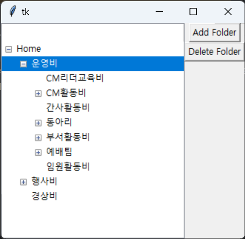
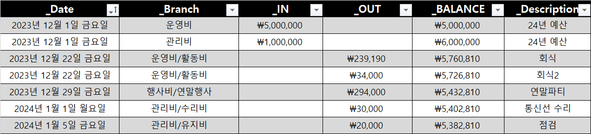
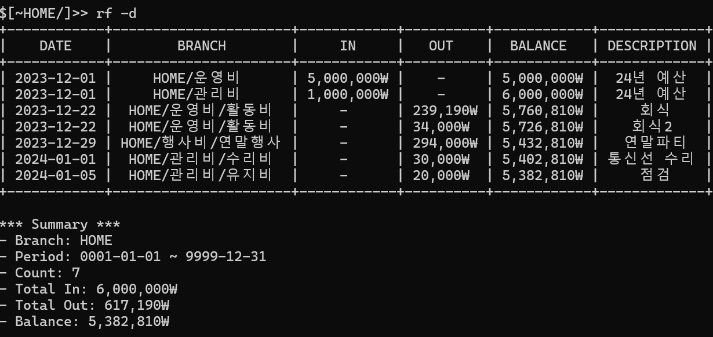
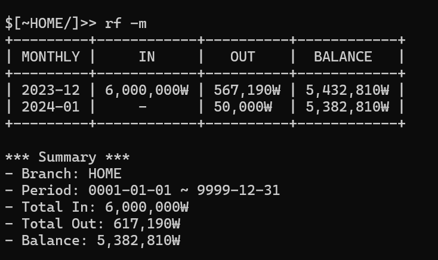
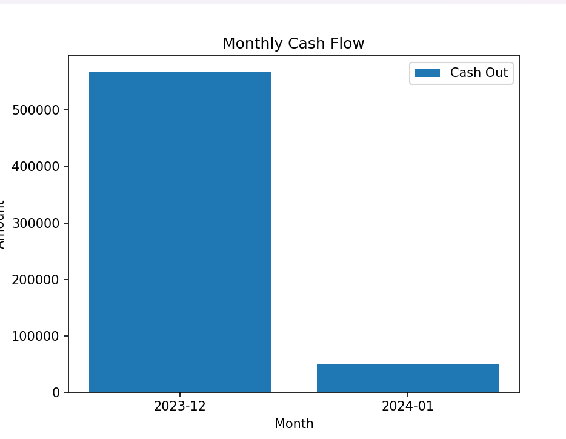

## 🌳 프로젝트 소개 (Project Description)
Finance Tree는 금융 거래를 관리하고 조직화하는 커맨드 라인 인터페이스 도구입니다. 사용자는 마치 파일 시스템을 탐색하듯, 금융 거래를 트리 구조로 관리할 수 있습니다. 이 도구는 SQLite 데이터베이스를 사용하여 거래 내역을 조회하며, 다양한 커맨드를 통해 데이터를 쉽게 관리할 수 있습니다.


## 🔄 버전

- 현재 버전: v2.1

## ⚙️ 기능 

- 재정 데이터의 다양한 분기를 탐색
- 일별 및 월별 형식으로 거래 내역을 나열하고 보기
- 수입, 지출, 잔액 개요에 대한 시각적 그래프 생성
- `tree` 명령어를 통해 사용자가 직접 브랜치 구성
- `Transaction.xlsx` 파일을 통해 거래 내역 입력 및 관리
- 외부 Excel 파일에서 거래 데이터 가져오기
- 백업이나 오프라인 분석을 위해 재정 데이터를 Excel로 내보내기

## 🚀 시작하기 

### 사전 요구사항

- Python 3.8 이상
- 필요한 Python 라이브러리: pandas, openpyxl, matplotlib

### 설치 및 실행

1. 로컬 머신에 저장소를 복제합니다:
   ```sh
   git clone https://github.com/20161609/FinanceTreeProject.git
   ```

2. 필요한 Python 라이브러리를 설치합니다:
   ```sh
   pip install pandas openpyxl matplotlib
   ```

3. 프로그램을 실행하려면, `Executable` 폴더 내의 실행 파일을 사용합니다. (폴더 단위로 복사 후, 타 디렉토리에서도 사용 가능합니다.)

4. 사용 가능한 명령어와 옵션 목록을 보려면 `help` 명령어를 사용하세요.

### 파일 구성 및 사용 방법

- **명령어 활용**: 명령어 입력을 통해 데이터를 관리합니다. 사용 가능한 명령어는 다음과 같습니다.
   - `cd [브랜치경로/번호]`: 브랜치 이동
   - `ls`: 현재 브랜치의 자식 목록 표시
   - `tree`: 유저가 브랜치 구조를 관리
   - `rf [-d | -m | -t] [날짜범위]`: 데이터 조회
   - `graph [in | out] [날짜범위]`: 그래프로 데이터 표시
   - `excel [-d | -m] [날짜범위]`: 데이터를 Excel 파일로 출력
   - `sync`: 데이터베이스 동기화

---
- **트리 구성**: 사용자가 직접 재정 데이터의 분기를 구성할 수 있습니다. 브랜치 구성의 예시를 포함하여, 사용자가 이 구조를 이해하고 자신의 필요에 맞게 수정할 수 있도록 도와줍니다.

---

- **Transaction.xlsx**: 사용자가 직접 거래 내역을 입력합니다. 이 파일에는 수입과 지출 데이터가 모두 포함되며, 프로그램을 통해 이 데이터를 확인하고 관리할 수 있습니다.

---
- **활용 예시**: 윈도우 커멘드 창의 방식과 유사합니다. 

---

---

---
